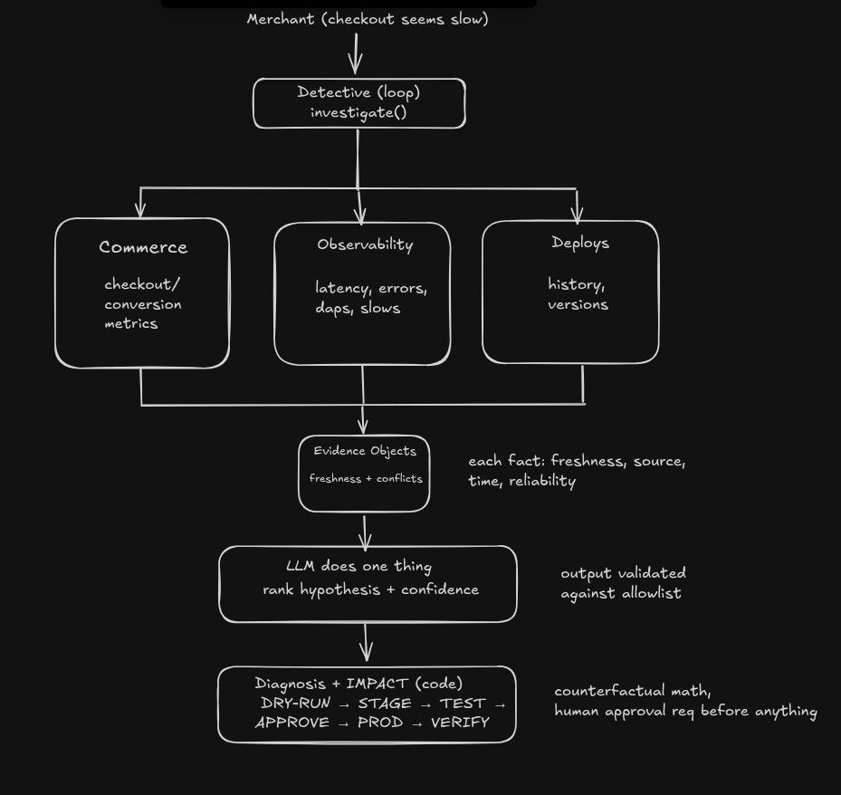

# Revenue Guard

An evidence-driven incident response system for commerce. It correlates
revenue-journey telemetry with application, dependency, and deployment signals;
uses an LLM only for hypothesis generation and evidence interpretation; and moves
verified remediations through a deterministic staging and approval workflow.

Independent project inspired by publicly described commerce reliability problems.
Not Urumi internals — see `docs/assumptions.md` and `docs/urumi-analysis.md`.

## Why I Built This

I studied Urumi's public product direction (Revenue/Builder/Analytics AI, MCP,
Dev-only writes, staging + rollback) and noticed the recurring gap: traditional
uptime can report healthy while customers cannot complete purchases. The FDE role
Urumi hires for — discover pain, prototype, deploy, iterate, eval-harness,
production-harden, generalize to platform — is exactly this loop.

## Problem

Partial regressions (slow checkout, payment-fail rise, mobile-only collapse,
pricing mismatch, cache bust) don't trip `GET /` checks. A vanilla WooCommerce
agent sees commerce data but not infra traces, deploy history, or staging state —
so it can't answer "did our last deploy hurt conversion, and what do we do safely?"

## Product Thesis

Revenue-aware monitoring: lead with lost orders / $ impact / affected journey /
confidence / recommended action; keep raw infra metrics one click down. Observed
metrics and estimated counterfactuals are always labeled separately, and the
system says INSUFFICIENT_EVIDENCE when telemetry can't support a claim.

## System Architecture



```
Commerce (sim default, Woo optional) -> deterministic telemetry ->
deterministic detection -> stage-gated ToolRegistry -> LLM hypothesis/evidence ->
deterministic diagnosis + counterfactual impact -> DRY_RUN -> staging ->
deterministic validation -> human approval -> prod -> symmetric verification ->
evals + provenance
```

See `docs/architecture.md`. Postgres = record (SQLite fallback locally, Redis
optional/ephemeral only). MCP is a read-only adapter over the same registry.

## Agent Architecture

Iterative, deterministic state machine:
`DETECTED -> TRIAGED -> INITIAL_HYPOTHESES ⇄ COLLECT_EVIDENCE ⇄ UPDATE_HYPOTHESES
-> DIAGNOSIS -> IMPACT -> RECOMMENDATION -> DRY_RUN -> STAGING -> VALIDATION ->
APPROVAL -> DEPLOYED -> VERIFICATION -> RESOLVED` (+ INSUFFICIENT_EVIDENCE etc.).
10 typed tools, stage-gated in code. LLM (gpt-5-mini live, mockable offline) only
ranks hypotheses / interprets evidence / narrates. No raw CoT in UI — evidence
objects with `observed_at/collected_at/freshness` + diagnosis with
HIGH/MEDIUM/LOW + breakdown.

## Detection

Boring by design: rolling z-score + prev-period + p50/p95, emitting
`baseline/current/deviation%`. No ML detector. Tuned on seeded baselines.

## Investigation

Competing hypotheses (2–4) with supporting/contradicting/missing evidence and
the discriminating measurement named. Dependency-first ordering (payment/
pricing/cohort before deploy-blame) after the v0.1 misleading-correlation failure.

## Root Cause Analysis

Diagnosis record links every claim to evidence_ids; freshness-weighted;
`causal_direct` honestly `weak` (correlation, not proven causation) until
validation proves recovery.

## Revenue Impact

Counterfactual: `expected = sessions × baseline_conv`,
`lost = expected − observed`, `impact = lost × AOV`
(e.g. 12,000 × 3.8% = 456 expected vs 300 observed → 156 lost × $84 ≈ $13,104).
Refuses when under-sampled.

## Safe Remediation

`RECOMMENDATION -> DRY_RUN ("WOULD rollback, nothing done") -> STAGING ->
VALIDATION (synthetic checkout) -> APPROVAL (explicit human) -> PROD ->
VERIFICATION (same signals re-checked)`. Idempotency-keyed writes; prod refuses
without APPROVED approval; multi-step rollouts journal + resume.

## Evaluation

Three tiers (`evals/`): Tier1 canonical (15 hand-written) · Tier2 generated
(450 perturbed runs: fault x traffic x AOV x timing) · Tier3 adversarial (4:
stale/conflict/multi/injection) + 5 private held-out (never tuned to). Every
rate reports N + Wilson 95% CI. 3 judges (free-form/rubric/evidence) + human
labels with Cohen's kappa + grader mutation tests.
Current: harness correctness 15/15 canonical [0.80,1.00]; Tier2 0.933
[0.906,0.953] with attribution|detected 330/330 and 30 sub-threshold misses;
Tier3 4/4; private 5/5; unsafe 0/474. Agent/model performance on a live LLM is
PENDING — mock numbers measure the harness, not model quality. See
`docs/validation-report.md` (generated) and `docs/evaluation.md`.

## Failure Analysis

v0.1 deploy-blame → dependency-first fix; transient over-confidence accepted as
known limitation; pricing never auto-modified. Full log: `docs/failure-analysis.md`.
Taxonomy: 15 classes in `domain/failures.py`.

## Red Teaming

Injection in commerce content blocked; stale/gapped telemetry → IDK; partial
rollout crash resumes without double-apply (`tests/test_redteam.py`); duplicate
rollback returns stored result; stage-gating raises PermissionError.

## Tradeoffs (intentionally NOT built)

No K8s/Kafka/vector-DB/LangGraph-first/MCP-first/ML-detector/Next.js. Redis
optional. Real-Woo profile bounded to 4 checks. Numeric confidence only after
calibration. See `docs/decisions.md`.

## Results

`uv run pytest` 122 passed · `ruff` clean · harness correctness 15/15 [0.80,1.0] ·
Tier2 0.933 [0.906,0.953] (attribution|detected 330/330) · Tier3 4/4 · private
5/5 · unsafe 0/474 · inter-judge kappa 1.00 (correlated by construction, not a
result) · human-vs-rubric kappa 0.00 on n=6 with 2 deliberate disagreements
(statistically negligible by design) · golden E2E verify PASS. Full report with
uncertainty: `docs/validation-report.md`.

## Running Locally

```bash
cp .env.example .env
uv sync --extra dev
uv run python commerce/sim/seed.py
uv run pytest -q
uv run python evals/runner/run.py
uv run python evals/judges/judges.py
uvicorn apps.api.main:app --port 8000   # dashboard at /ui, JSON at /investigate
docker compose up --build                 # postgres profile
docker compose -f docker-compose.yml -f docker-compose.woo.yml up  # optional real Woo
printf '{"id":1,"method":"tools/list"}\n' | uv run python agent/mcp_adapter.py
```

## Demo

Golden `bad_shipping_deploy_001`: seed → inject v2.4.1 → checkout ~1650ms /
conv ~2.5% → investigate (HIGH, evidence-linked) → counterfactual $ → DRY_RUN →
stage → validate PASS → approve → verify PASS → RESOLVED. Full script: `docs/demo.md`.

## Future Work

Postgres-backed run history in UI, HTMX polish + charts, nightly Woo profile in CI,
official MCP SDK swap, alert hysteresis for transients, per-cohort AOV, cost/latency
tracking at 10→1000 stores (store_id boundary already in schema).
